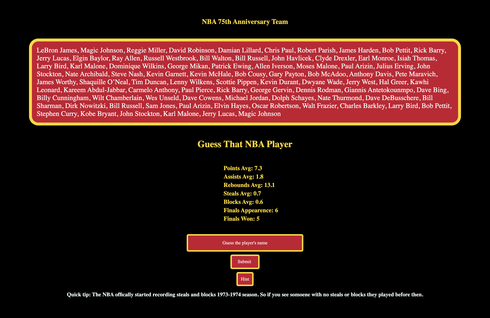

# 🏀 Guess That NBA Player - Frontend

This is the React-based frontend for the **Guess That NBA Player** game — a challenge where users guess a legendary NBA player based on their career stats. All players come from the NBA’s 75th Anniversary Team.

---

## 🔥 About the Game

You’ll be shown a mystery player’s **career stats** (Points, Assists, Rebounds, Steals, Blocks, Finals appearances and wins). Your goal? **Guess the correct player** based on those stats. If you're stuck, hit the **Hint** button to reveal the player’s initials.

---

## 🛠 Tech Stack

- **React** (Functional Components + Hooks)
- **Axios** for API calls
- **Custom CSS** for styling
- Communicates with a backend built in **Express.js** with **Prisma** for the database

---

## 🚀 Getting Started

## By default the api makes calls to http://localhost:3000/api it's best to set up the backend and make sure it is running before setting up the frontend.
the backend can be found at https://github.com/MikealFowler/Guess-that-nba-player-backendGuess-that-nba-player-backend

### 1. Clone the Repo

```bash
git clone https://github.com/MikealFowler/Guess-that-nba-player-backendGuess-that-nba-player-frontend.git
cd guess-that-nba-player-frontend
```

### 2. Install Dependencies

```bash
npm install
```

### 3. Start the App

```bash
npm run dev
```

The app will run on `http://localhost:5173` by default (if you're using Vite).

> Make sure your backend is also running and accessible at the expected API base URL.

---

## 🧠 Features

- 🎯 Guess a player based on real NBA stats
- 💡 Toggle a hint for player initials
- 🔄 Automatically load a new player after each correct guess
- 🧪 Quick tip built-in about stat era differences (like when steals & blocks were tracked)

---

## 📁 Project Structure

```
src/
├── App.jsx         # Main game logic
├── api.js          # Axios instance
├── App.css         # Styling
└── ...
```

---

## 📝 To-Do

- Show correct answer after a wrong guess (after so many tries)
- Add difficulty modes (e.g., hide more stats)
- Enhance UI/UX for mobile

---
## 🐳 Run the Frontend with Docker

To run the frontend in a Docker container and access it in your browser:

### 1. Build or Pull the Docker image:
```bash
docker build -t guess-that-nba-player-frontend .
docker pull mikealfowler/guess-that-nba-player-frontend:0.0.1
```

### 2. Run the container:
```bash
docker run -d -p 5173:5173 mikealfowler/guess-that-nba-player-frontend:0.0.1
```

### 3. Open your browser and go to:
[http://localhost:5173](http://localhost:5173)

> 💡 If `localhost` doesn’t work, try:  
> [http://127.0.0.1:5173](http://127.0.0.1:5173)

---

## 🙌 Credits

NBA stats and player list based on the **NBA 75th Anniversary Team**.

Made with 💪, caffeine, and a love for basketball.

---

## 📸 Screenshot

 

---

## 📬 Feedback

Found a bug? Want to request a feature? Open an issue or reach out.